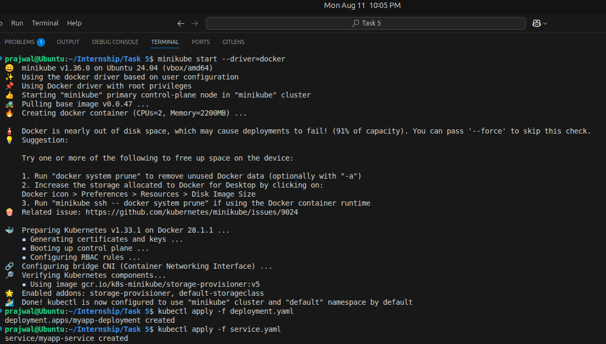
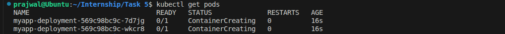
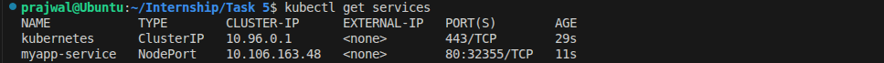
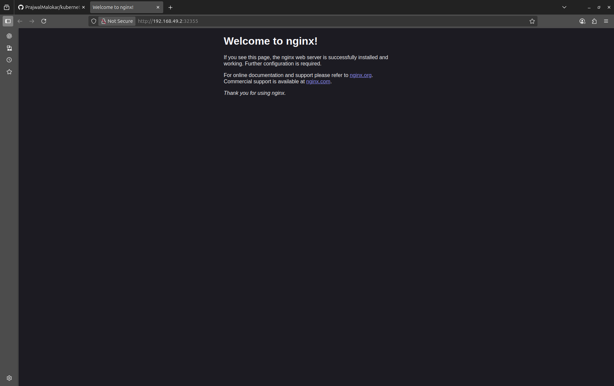

# Kubernetes Deployment with Minikube

## 📌 Project Overview
This project demonstrates how to set up a local Kubernetes cluster using **Minikube**, deploy an application (Nginx), expose it via a service, and manage scaling using `kubectl`.

## 🛠 Tools & Technologies
- **Kubernetes** (Minikube)
- **kubectl**
- **Docker**
- **YAML** for deployments and services

---

## 🚀 Steps to Run the Project

### 1. Install Minikube & Start the Cluster
```bash
minikube start --driver=docker
```

### 2. Create Deployment

```bash
kubectl apply -f deployment.yaml
```

### 3. Expose Deployment via Service

```bash
kubectl apply -f service.yaml
```

### 4. Verify Pods and Services

```bash
kubectl get pods
kubectl get services
```

### 5. Scale Deployment

```bash
kubectl scale deployment myapp-deployment --replicas=4
```

### 6. Access Application

```bash
minikube service myapp-service
```

---

## 📂 Project Structure

```
.
├── deployment.yaml
├── service.yaml
└── README.md
```

---

## 📸 Screenshots

### 1. Minikube Cluster Started



### 2. Pods Running



### 3. Services Running



### 4. Application in Browser



---

## 📚 Learning Outcomes

By completing this project, you will:

* Understand Kubernetes **deployments** and **services**
* Learn to **scale** applications with `kubectl`
* Get hands-on experience with **Minikube**
* Practice writing Kubernetes **YAML manifests**

---

## 🖋 Author

**Prajwal Malokar**
[LinkedIn](https://linkedin.com/in/prajwal-malokar) | [GitHub](https://github.com/PrajwalMalokar)
